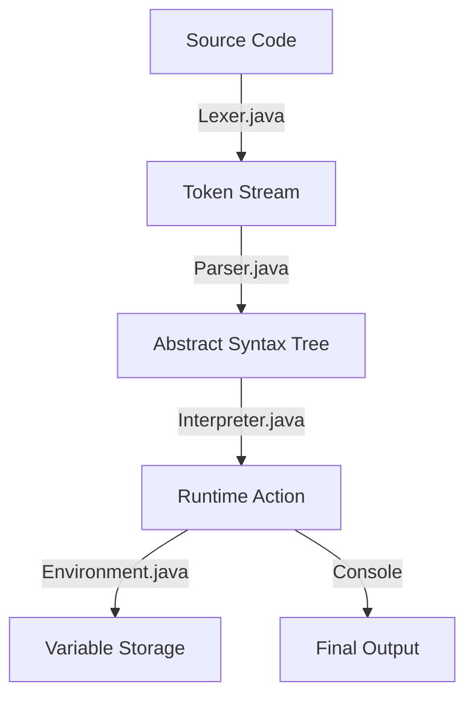

# Understanding the LEXOR Interpreter Flow

To understand how the **LEXOR** interpreter works, let's trace a simple program through the three main stages of the pipeline: **Lexing**, **Parsing**, and **Interpreting**.

### The Example Program (`program.lexor`)
```lexor
SCRIPT AREA
START SCRIPT
    DECLARE INT x = 10
    PRINT: "Value is: " & x
END SCRIPT
```

---

### Step 1: Lexing (The `Lexer`)
The **Lexer** reads the raw source text and breaks it into logical "words" called **Tokens**. It ignores whitespace and recognizes keywords, operators, and literals.

**Visualizing the Token Stream:**
The source code is converted into a list of `Token` objects:

| Lexeme         | TokenType    | Literal Value  |
| :------------- | :----------- | :------------- |
| `SCRIPT`       | `SCRIPT`     | `null`         |
| `AREA`         | `AREA`       | `null`         |
| `START`        | `START`      | `null`         |
| `SCRIPT`       | `SCRIPT`     | `null`         |
| `DECLARE`      | `DECLARE`    | `null`         |
| `INT`          | `INT`        | `null`         |
| `x`            | `IDENTIFIER` | `"x"`          |
| `=`            | `EQUAL`      | `null`         |
| `10`           | `NUMBER`     | `10`           |
| `PRINT`        | `PRINT`      | `null`         |
| `:`            | `COLON`      | `null`         |
| `"Value is: "` | `STRING`     | `"Value is: "` |
| `&`            | `AMPERSAND`  | `null`         |
| `x`            | `IDENTIFIER` | `"x"`          |
| `END`          | `END`        | `null`         |
| `SCRIPT`       | `SCRIPT`     | `null`         |

---

### Step 2: Parsing (The `Parser`)
The **Parser** takes the list of tokens and organizes them into a **tree structure** called an **Abstract Syntax Tree (AST)**. This tree represents the grammatical structure of the program.

**Visualizing the AST:**
The parser produces a `List<Stmt>` (Statements).

```text
[Statement List]
 ├── Stmt.Declare (Type: INT)
 │    ├── Name: "x"
 │    └── Initializer: Expr.Literal (Value: 10)
 └── Stmt.Print
      ├── Expr.Literal (Value: "Value is: ")
      └── Expr.Variable (Name: "x")
```

---

### Step 3: Interpreting (The `Interpreter`)
The **Interpreter** "walks" the AST tree. It uses the **Visitor Pattern** to visit each node and perform the actual work. It relies on the **Environment** to store variable values.

**Step-by-Step Execution:**

1.  **Visit `Stmt.Declare`**:
    *   The interpreter asks the **Environment** to `define("x", "INT")`.
    *   The **Environment** creates a memory slot for `x` and initializes it to the default `0`.
    *   The interpreter evaluates the initializer `Expr.Literal(10)`, getting the Java integer `10`.
    *   It calls `environment.assign("x", 10)`, updating the memory.

2.  **Visit `Stmt.Print`**:
    *   It evaluates the first expression: `Expr.Literal("Value is: ")` -> returns the string.
    *   It evaluates the second expression: `Expr.Variable("x")`.
        *   The interpreter asks the **Environment** to `get("x")`.
        *   The **Environment** looks up `x` and returns `10`.
    *   The interpreter prints both values to the console: `Value is: 10`.

---

### Summary Flow Diagram



### Key Components:
*   **`Environment.java`**: The "RAM" of the interpreter. It manages variable storage and enforces strict typing.
*   **`Expr.java` & `Stmt.java`**: Definitions for Expression and Statement nodes in the AST.
*   **Visitor Pattern**: A design pattern used by the Interpreter to traverse the AST and execute logic for each node type.
*   **EOF (End Of File)**: A special token used to signal the end of the source code, helping the parser detect incomplete programs.
